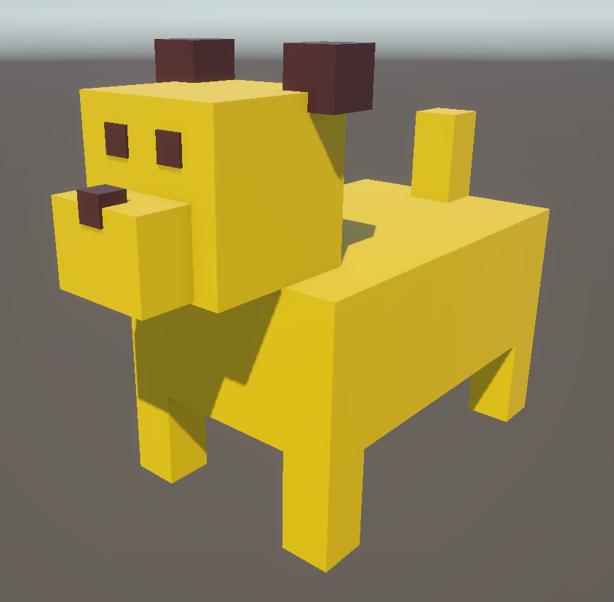
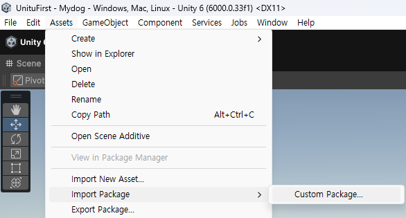

# Chapter1_GettingStarted
`.unitypackage` 파일이 준비되어 있습니다. [Chapter1.unitypackage](Chapter1_GettingStarted\Chapter1.unitypackage) 파일을 다운로드 후 `import`하면 "Chapter1"의 예제와 동일한 결과물을 살펴보실 수 있습니다.

 

---

### Import 방법
1. [Chapter1.unitypackage](Chapter1_GettingStarted\Chapter1.unitypackage) 파일을 다운로드합니다.
2. 유니티 에디터를 열어서 상단 메뉴바의 `Assets > Import Package > Custom Package...` 을 선택합니다. 
    
3. 다운받은 `Chapter1.unitypackage` 파일을 선택합니다.
4. 중복에 주의하며 `import` 합니다. 
    

    > **🚨 주의 사항**
    >
    > `import`할 때에 **같은 폴더 경로**에 **같은 파일명**을 가진 파일은 새로운 파일로 덮어씌워집니다!

