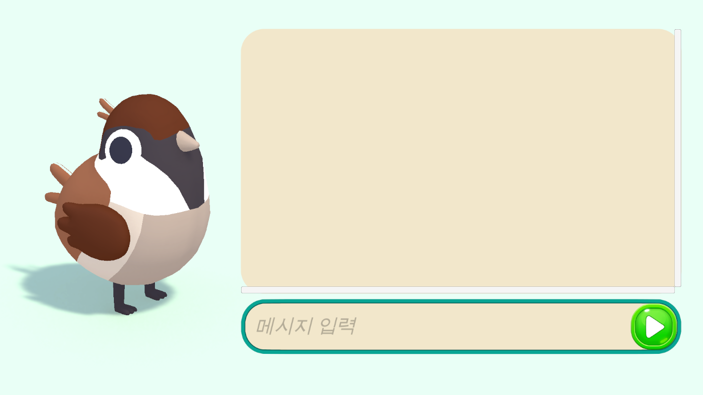
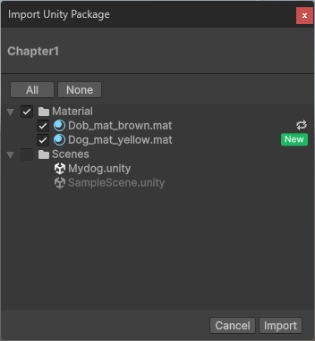

# Chapter4_UnityAI

`.unitypackage` 파일이 준비되어 있습니다. 반드시 [Sparrow - Quirky Series](https://assetstore.unity.com/packages/3d/characters/animals/sparrow-quirky-series-247228)에셋을 먼저 `import`하고 난 후에 [Chapter4.unitypackage](Chapter1_GettingStarted\Chapter1.unitypackage) 파일을 설치하셔야 합니다.

 

---

### Import 방법
1. 에셋스토어에서 [Sparrow - Quirky Series](https://assetstore.unity.com/packages/3d/characters/animals/sparrow-quirky-series-247228)에셋을 다운로드 후 `import` 합니다.
2. [Chapter4.unitypackage](Chapter1_GettingStarted\Chapter1.unitypackage) 파일을 다운로드합니다.
3. 유니티 에디터를 열어서 상단 메뉴바의 `Assets > Import Package > Custom Package...` 을 선택합니다. 

4. 다운받은 `Chapter1.unitypackage` 파일을 선택합니다.
5. 중복에 주의하며 `import` 합니다. 

    >  
    > 
    > **🚨 주의 사항**
    >
    > `import`할 때에 **같은 폴더 경로**에 **같은 파일명**을 가진 파일은 새로운 파일로 덮어씌워집니다!  