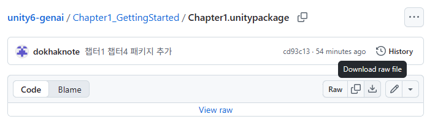

# unity6-genai
각 챕터별로 필요한 리소스가 준비되어있습니다. 필요한 리소스를 찾아 자유롭게 다운로드하셔서 사용하세요.

 

---

### 개별 파일 다운로드 방법
1. 파일 경로로 이동합니다. 
 

2. 다운로드 아이콘  클릭합니다.

 

---

### 개별 폴더 다운로드 방법

1. 아래의 주소 맨 뒤에 다운로드 하고 싶은 폴더의 주소를 붙여넣습니다. 
`https://downgit.github.io/#/home?url=`<폴더주소>

 

2. 예를 들어 Chapter1_GettingStarted의 Assets/Material 폴더를 다운로드 하고싶다면 해당 폴더로 이동합니다. 

 

3. 브라우저 상단의 주소창에서 주소를 복사하여 다음과 같이 완성합니다. 
`https://downgit.github.io/#/home?url=`https://github.com/dokhaknote/unity6-genai/tree/main/Chapter1_GettingStarted/Assets/Material

 

4. 그 후 완성된 주소를 복사하여 브라우저 주소란에 붙여넣기하면 자동으로 다운로드 받아집니다. 

